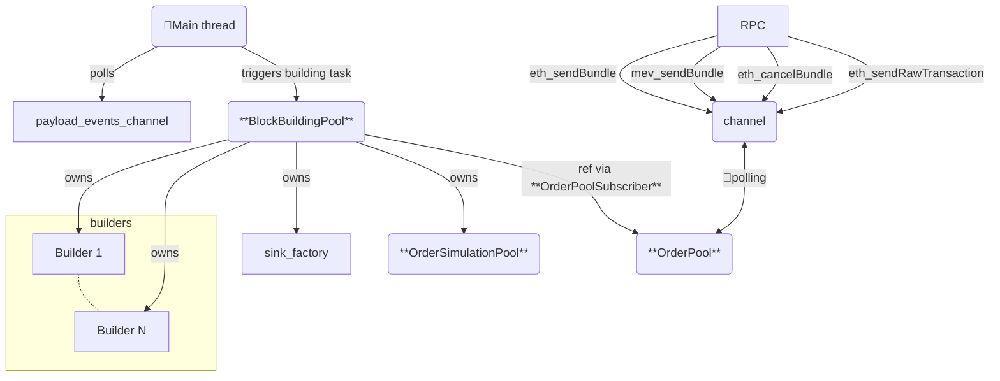
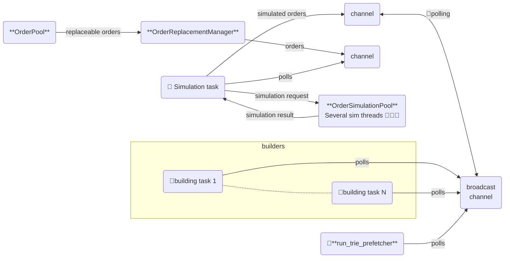

# rbuilder Classes and Dataflow

The [`LiveBuilder`](../crates/rbuilder/src/live_builder/mod.rs) struct is the core component of rbuilder.

## Core Components

To create a `LiveBuilder`, you need the following main components:

1. `blocks_source`: The source of slots to build. Implements the [`SlotSource`](../crates/rbuilder/src/live_builder/mod.rs) trait. This abstraction enables rbuilder to handle block building in various contexts:
   - L1: Consensus client generating slots with potential forks
   - L2: Sequencer generating slots

2. `builders`: A vector of objects implementing the [`BlockBuildingAlgorithm`](../crates/rbuilder/src/building/builders/mod.rs) trait. Each builder:
   - Takes a base block and a stream of simulated orders
   - Continuously generates new blocks
   - Optimizes to maximize the true block value

3. `sink_factory`: A factory for the destination of built blocks. Implements [`UnfinishedBlockBuildingSinkFactory`](../crates/rbuilder/src/building/builders/mod.rs). This abstraction supports different contexts:
   - L1: Requires bidding
   - L2: No bidding needed
   - Testing environments

## Initialization Process

The main entrypoint `LiveBuilder::run()` initializes several long-lived components:

- **RPC Module**: 
  - Listens for RPC calls (primarily order flow input)
  - Pushes received data to a channel

- **[OrderPool](../crates/rbuilder/src/live_builder/order_input/orderpool.rs)**:
  - Receives RPC commands (order flow)
  - Stores orders in memory
  - Provides subscription mechanism for block orders

- **[OrderSimulationPool](../crates/rbuilder/src/live_builder/simulation/mod.rs)**:
  - Manages a pool of threads ready for order simulation
  - Handles concurrent order simulations

- **[BlockBuildingPool](../crates/rbuilder/src/live_builder/building/mod.rs)**:
  - Aggregates multiple components:
    - OrderPool
    - OrderSimulationPool
    - LiveBuilder::sink_factory
    - LiveBuilder::builders
  - Triggers block building tasks

- **payload_events_channel**:
  - A channel of [`MevBoostSlotData`](../crates/rbuilder/src/live_builder/payload_events/mod.rs)
  - Receives block-building opportunities
  - Each received `MevBoostSlotData` triggers a new block-building task via `BlockBuildingPool`
  - Sources slots from `LiveBuilder::blocks_source`

## Block building
The block building process begins with a flow of `ReplaceableOrderPoolCommand`s arriving from the `OrderPool` (subscription via an OrderPoolSubscriber). These operations can be:
- Add new order (`ReplaceableOrderPoolCommand::Order`)
- Replace existing order (`ReplaceableOrderPoolCommand::Order` for an already existing uuid)
- Cancel order (`ReplaceableOrderPoolCommand::CancelBundle`/`ReplaceableOrderPoolCommand::CancelShareBundle`)

Throughout the order pipeline, we consistently use these commands instead of plain `Orders` since the entire pipeline must handle updates and cancellations.

As mentioned before, the `BlockBuildingPool` starts the block building task (`BlockBuildingPool::start_block_building`) which involves the following connections:
- An [OrderReplacementManager](../crates/rbuilder/src/live_builder/order_input/order_replacement_manager.rs) is created and set as the sink for the block's orderflow (`OrderPoolSubscriber::add_sink`). The `OrderReplacementManager` has 2 main responsibilities:

    - Update/Cancelation handling: The `OrderReplacementManager` transforms all cancels and updates into add/remove operations. From this point downstream, the system is not aware of updates/cancellations.
    - Sequence correction: Cancels and updates have a sequence number. Due to external simulation timings, these operations might arrive out of order. `OrderReplacementManager` ensures that the operation with the largest sequence number is always the one used.
- To adapt the push nature of `OrderReplacementManager` to the pull nature of the simulation stage, an [OrdersForBlock](../crates/rbuilder/src/live_builder/order_input/orderpool.rs) is inserted. It simply pushes order operations on a channel for the simulation to poll.
- A simulation task is spawned via `OrderSimulationPool::spawn_simulation_job` taking the above-mentioned channel as input. Simulations are performed using the threads created on `OrderSimulationPool::new`. The output of the simulations is pushed to a channel (inside `SlotOrderSimResults`) of `SimulatedOrderCommand`. Note that the simulation stage also propagates cancellations.

- A destination for the generated blocks (`UnfinishedBlockBuildingSink`) is created from `BlockBuildingPool::sink_factory` via `UnfinishedBlockBuildingSinkFactory::create_sink`.
- To multiplex from the single-receiver simulations channel to the multiple destinations (builders), a broadcast channel is created along with a forwarding task.
- One new task is spawned for each `BlockBuildingAlgorithm` in `BlockBuildingPool::builders`. The same `UnfinishedBlockBuildingSink` created above is used as the sink for all building algorithms.
- An extra task is spawned to prefetch data to speed up root hash calculations (`run_trie_prefetcher`).

The output of this stage consists of filled blocks (`BlockBuildingHelper`) which can still be upgraded and usually need the final payout transaction to the validator to be added. These blocks also need to be sealed, which mainly involves computing the root hash of the final state—an expensive operation that we only want to perform at the last moment when we know we are going to bid with the block.

Note that at this point we remain network agnostic; the result could be used for either L1 or L2.

## Block sealing and bidding

This part is specific for L1 bidding.

