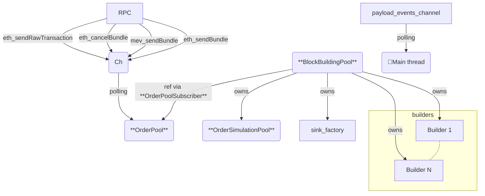

# rbuilder Classes and Dataflow

The [`LiveBuilder`](../crates/rbuilder/src/live_builder/mod.rs) struct is the core component of rbuilder.

## Core Components

To create a `LiveBuilder`, you need the following main components:

1. `blocks_source`: The source of slots to build. Implements the [`SlotSource`](../crates/rbuilder/src/live_builder/mod.rs) trait. This abstraction enables rbuilder to handle block building in various contexts:
   - L1: Consensus client generating slots with potential forks
   - L2: Sequencer generating slots

2. `builders`: A vector of objects implementing the [`BlockBuildingAlgorithm`](../crates/rbuilder/src/building/builders/mod.rs) trait. Each builder:
   - Takes a base block and a stream of simulated orders
   - Continuously generates new blocks
   - Optimizes to maximize the true block value

3. `sink_factory`: A factory for the destination of built blocks. Implements [`UnfinishedBlockBuildingSinkFactory`](../crates/rbuilder/src/building/builders/mod.rs). This abstraction supports different contexts:
   - L1: Requires bidding
   - L2: No bidding needed
   - Testing environments

## Initialization Process

The main entrypoint `LiveBuilder::run()` initializes several long-lived components:

- **RPC Module**: 
  - Listens for RPC calls (primarily order flow input)
  - Pushes received data to a channel

- **[OrderPool](../crates/rbuilder/src/live_builder/order_input/orderpool.rs)**:
  - Receives RPC commands (order flow)
  - Stores orders in memory
  - Provides subscription mechanism for block orders

- **[OrderSimulationPool](../crates/rbuilder/src/live_builder/simulation/mod.rs)**:
  - Manages a pool of threads ready for order simulation
  - Handles concurrent order simulations

- **[BlockBuildingPool](../crates/rbuilder/src/live_builder/building/mod.rs)**:
  - Aggregates multiple components:
    - OrderPool
    - OrderSimulationPool
    - LiveBuilder::sink_factory
    - LiveBuilder::builders
  - Triggers block building tasks

- **payload_events_channel**:
  - A channel of [`MevBoostSlotData`](../crates/rbuilder/src/live_builder/payload_events/mod.rs)
  - Receives block-building opportunities
  - Each received `MevBoostSlotData` triggers a new block-building task via `BlockBuildingPool`
  - Sources slots from `LiveBuilder::blocks_source`

